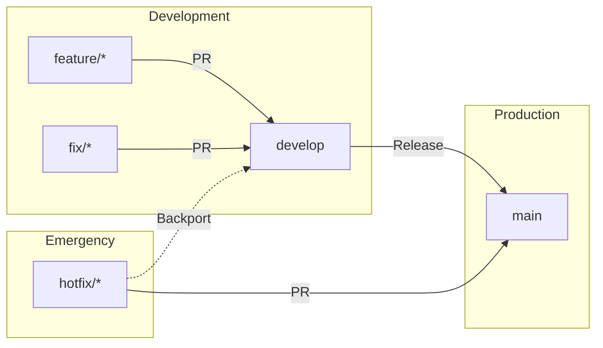

# Contributing to HKG Flight Viewer

Thank you for your interest in contributing! This document outlines our branching strategy and development workflow.

## Branching Strategy

We use a simplified Git Flow model:



### Branch Types

| Branch      | Purpose                                         | Base      | Merge To           |
| ----------- | ----------------------------------------------- | --------- | ------------------ |
| `main`      | Production-ready code, deployed to GitHub Pages | -         | -                  |
| `develop`   | Integration branch for features                 | `main`    | `main`             |
| `feature/*` | New features or enhancements                    | `develop` | `develop`          |
| `fix/*`     | Bug fixes                                       | `develop` | `develop`          |
| `hotfix/*`  | Critical production fixes                       | `main`    | `main` & `develop` |

### Branch Naming Conventions

```
feature/<issue-number>-<short-description>
fix/<issue-number>-<short-description>
hotfix/<issue-number>-<short-description>
```

Examples:

- `feature/12-flight-search-filters`
- `fix/45-gate-link-broken`
- `hotfix/99-api-cors-error`

## Development Workflow

### 1. Starting New Work

```bash
# Ensure develop is up to date
git checkout develop
git pull origin develop

# Create feature branch
git checkout -b feature/123-my-feature
```

### 2. During Development

```bash
# Run tests before committing
npm run test

# Commit with conventional commit messages
git commit -m "feat: add flight search filters"
git commit -m "fix: correct gate link URL encoding"
```

### 3. Submitting Changes

```bash
# Push your branch
git push origin feature/123-my-feature

# Create Pull Request to develop branch
```

### 4. After Merge

```bash
# Delete local branch
git branch -d feature/123-my-feature
```

## Commit Message Convention

We follow [Conventional Commits](https://www.conventionalcommits.org/):

```
<type>(<scope>): <description>

[optional body]

[optional footer(s)]
```

### Types

| Type       | Description                                             |
| ---------- | ------------------------------------------------------- |
| `feat`     | New feature                                             |
| `fix`      | Bug fix                                                 |
| `docs`     | Documentation only                                      |
| `style`    | Formatting, no code change                              |
| `refactor` | Code change that neither fixes a bug nor adds a feature |
| `test`     | Adding or updating tests                                |
| `chore`    | Maintenance tasks, dependency updates                   |

### Examples

```
feat(dashboard): add date picker for archived data
fix(parser): handle null terminal value in API response
docs(readme): update installation instructions
chore(deps): upgrade solidjs to v1.9.5
```

## GitHub Actions

### Development Mode (Current)

During development, workflows are configured to save GitHub Actions minutes:

- **CI**: Only runs on Pull Requests (not on push)
- **Archive**: Manual trigger only (`workflow_dispatch`)
- **Deploy**: Only runs on push to `main`

### Production Mode

When ready for production, update `.github/workflows/archive.yml` to re-enable the schedule:

```yaml
on:
    schedule:
        - cron: "0 16 * * *" # 00:00 HKT
    workflow_dispatch:
```

## Code Style

- **TypeScript**: Strict mode, no `any` types
- **No Enums**: Use const objects instead (due to `erasableSyntaxOnly: true`)
- **SolidJS Patterns**: Use `createSignal`, `createMemo`, not React hooks
- **Formatting**: Configured via ESLint and Prettier

### Const Object Pattern (Instead of Enums)

```typescript
// ✅ Correct
export const StatusType = {
    Departed: "departed",
    Cancelled: "cancelled",
} as const;
export type StatusType = (typeof StatusType)[keyof typeof StatusType];

// ❌ Wrong - causes compile errors
export enum StatusType { ... }
```

## Testing

```bash
# Run tests in watch mode
npm run test

# Run tests once
npm run test:run

# Run with coverage
npm run test:coverage
```

## Questions?

Open an issue for questions or suggestions!
