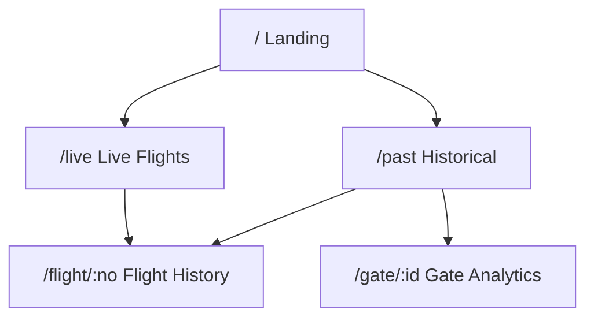

# Project Milestones

> Last Updated: 2026-01-16

## Overview

| Milestone | Status         | Description                    |
| --------- | -------------- | ------------------------------ |
| M1        | ✅ Complete    | Data Ingestion & Archiving     |
| M2        | ✅ Complete    | Domain Logic & Data Parsing    |
| M3        | ✅ Complete    | Page Structure & Data Fetching |
| M4        | 🚧 In Progress | UX Polish & Charts             |
| M5        | ⏳ Planned     | Deployment & Production        |

---

## M1: Data Ingestion & Archiving ✅

**Status:** Complete (2026-01-15)

Established automated pipeline to fetch, archive, and index flight data.

### Deliverables

- `scripts/archive-flights.js` - Fetches all 4 API categories
- `scripts/reindex-flights.js` - Rebuilds indexes from snapshots
- `scripts/analyze-data.js` - Data analysis tool
- Daily snapshots at `public/data/daily/YYYY-MM-DD.json`
- Flight indexes at `public/data/indexes/flights/{flightNo}.json`
- Gate indexes at `public/data/indexes/gates/{gateNo}.json`

### Data Collected

| Metric              | Value                              |
| ------------------- | ---------------------------------- |
| Date Range          | 2025-10-16 to 2026-01-16 (93 days) |
| Total Flights       | 104,732                            |
| Flight Index Shards | 3,849 files                        |
| Gate Index Shards   | 89 files                           |

---

## M2: Domain Logic & Data Parsing ✅

**Status:** Complete (2026-01-16)

Defined TypeScript interfaces and parsing utilities.

### Deliverables

- `src/types/flight.ts` - TypeScript definitions (const objects, no enums)
- `src/lib/parser.ts` - Raw API → `FlightRecord` transformation
- `src/lib/api.ts` - Unified API service layer
- `src/lib/resources.ts` - SolidJS `createResource` hooks
- `src/lib/airport-data.ts` - Airport code → name mapping
- `src/lib/airline-data.ts` - Airline info from HKIA JSON

### Test Coverage

| File                | Tests |
| ------------------- | ----- |
| `src/lib/parser.ts` | 37    |
| **Total**           | 37 ✅ |

---

## M3: Page Structure & Data Fetching ✅

**Status:** Complete (2026-01-16)

Built complete page structure with routing and data access.

### Pages

| Route          | Data Source  | Features                                               |
| -------------- | ------------ | ------------------------------------------------------ |
| `/`            | None         | Site introduction                                      |
| `/live`        | HKIA API     | Departures/Arrivals/Cargo tabs, 5-min refresh          |
| `/past/:date?` | Static JSON  | Date picker, URL param, Departures/Arrivals/Cargo tabs |
| `/flight/:no`  | Static Index | Flight history, on-time stats                          |
| `/gate/:id`    | Static Index | Gate usage analytics                                   |

### Components

- `DepartureCard` / `ArrivalCard` / `CargoFlightCard` - HKIA Visual DNA styling with Tooltip
- `FlightTimeStatus` - Integrated time + status display with delay visualization
- `FlightStatus` - Compact status badge (for tables)
- `FlightCardList` - Virtualized flight list
- `FlightSearch` - Unified search (navigate/filter modes)
- `Layout` - Navigation with Home/Live/History links

### Ark UI Components

- `Tabs` - Tab navigation (LivePage, PastPage)
- `DatePicker` - Date selection (PastPage)
- `Tooltip` - Hover information (all flight cards)
- `Collapsible` - Expandable sections (FlightHistoryPage, GateAnalyticsPage)
- `Combobox` - Search with suggestions (FlightSearch)

---

## M4: UX Polish & Charts 🚧

**Status:** In Progress

### Pending

- [ ] On-time performance charts (delay/cancel rates)
- [ ] Gate usage visualizations
- [ ] Route map visualization
- [ ] Live update diff highlighting
- [ ] Dark mode support

---

## M5: Deployment & Production ⏳

**Status:** Planned

### Goals

- [ ] Mobile responsiveness optimization
- [ ] Offline mode with localStorage caching
- [ ] PWA support
- [ ] GitHub Pages deployment
- [ ] Performance optimization (Lighthouse score)

---

## GitHub Actions

| Workflow | Trigger         | Status    |
| -------- | --------------- | --------- |
| CI       | PR to main      | ✅ Active |
| Archive  | Daily 00:00 HKT | ✅ Active |
| Deploy   | Push to main    | ✅ Active |
