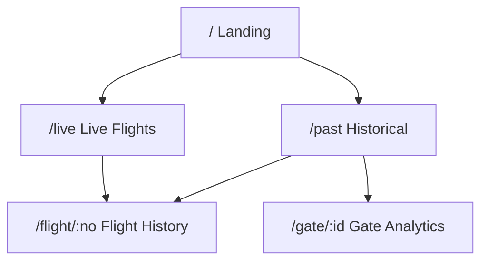

# Project Milestones

> Last Updated: 2026-01-22

## Overview


| Milestone | Status         | Description                          |
| --------- | -------------- | ------------------------------------ |
| M1        | ✅ Complete    | Data Ingestion & Archiving           |
| M2        | ✅ Complete    | Domain Logic & Data Parsing          |
| M3        | ✅ Complete    | Page Structure & Data Fetching       |
| M4        | 🚧 In Progress | Performance & Mobile Optimization    |
| M5        | ⏳ Planned     | HKIA Virtual Map & Visualization     |

---

## M1: Data Ingestion & Archiving ✅

**Status:** Complete (2026-01-15)

Established automated pipeline to fetch, archive, and index flight data.

### Deliverables

- `scripts/archive-flights.js` - Fetches all 4 API categories
- `scripts/reindex-flights.js` - Rebuilds indexes from snapshots
- `scripts/analyze-data.js` - Data analysis tool
- Daily snapshots at `public/data/daily/YYYY-MM-DD.json`
- Flight indexes at `public/data/indexes/flights/{flightNo}.json`
- Gate indexes at `public/data/indexes/gates/{gateNo}.json`

### Data Collected

| Metric              | Value                              |
| ------------------- | ---------------------------------- |
| Date Range          | 2025-10-16 to 2026-01-19 (96 days) |
| Total Flights       | ~108,000                           |
| Flight Index Shards | 3,849 files                        |
| Gate Index Shards   | 89 files                           |

---

## M2: Domain Logic & Data Parsing ✅

**Status:** Complete (2026-01-16)

Defined TypeScript interfaces and parsing utilities.

### Deliverables

- `src/types/flight.ts` - TypeScript definitions (const objects, no enums)
- `src/lib/parser.ts` - Raw API → `FlightRecord` transformation
- `src/lib/api.ts` - Unified API service layer
- `src/lib/resources.ts` - SolidJS `createResource` hooks
- `src/lib/airport-data.ts` - Airport code → name mapping
- `src/lib/airline-data.ts` - Airline info from HKIA JSON
- `src/lib/date-utils.ts` - HKT timezone date utilities

### Test Coverage

| File                    | Tests |
| ----------------------- | ----- |
| `src/lib/parser.ts`     | 37    |
| `src/lib/date-utils.ts` | 11    |
| **Total**               | 48 ✅ |

---

## M3: Page Structure & Data Fetching ✅

**Status:** Complete (2026-01-16)

Built complete page structure with routing and data access.

### Pages



| Route          | Data Source  | Features                                               |
| -------------- | ------------ | ------------------------------------------------------ |
| `/`            | None         | Site introduction, flight search                       |
| `/live`        | HKIA API     | Departures/Arrivals/Cargo tabs, 5-min refresh          |
| `/past/:date?` | Static JSON  | Date picker, URL param, Departures/Arrivals/Cargo tabs |
| `/flight/:no`  | Static Index | Flight history, on-time stats                          |
| `/gate/:id`    | Static Index | Gate usage analytics                                   |

### Components

- `DepartureCard` / `ArrivalCard` / `CargoFlightCard` - HKIA Visual DNA styling with Tooltip
- `FlightTimeStatus` - Integrated time + status display with delay visualization
- `FlightStatus` - Compact status badge (for tables)
- `FlightCardList` - Virtualized flight list
- `FlightSearch` - Unified search (navigate/filter modes) with flight list autocomplete
- `Layout` - Navigation with Home/Live/History links

### Ark UI Components

- `Tabs` - Tab navigation (LivePage, PastPage)
- `DatePicker` - Date selection (PastPage)
- `Tooltip` - Hover information (all flight cards)
- `Collapsible` - Expandable sections (FlightHistoryPage, GateAnalyticsPage)
- `Combobox` - Search with suggestions (FlightSearch)

---

## M4: Performance & Mobile Optimization 🚧

**Status:** In Progress

**Goal:** Fix mobile UI usability issues and ensure smooth performance when handling 100k+ records.

### Mobile-First Responsive Refactor

- [x] Convert DataTable to **stacked card layout** below `sm` breakpoint
- [x] Optimize `GateBadge` and `DestinationBadge` proportions for 412px screens
- [x] `GateAnalyticsPage` responsive redesign: card layout (mobile) / table layout (desktop)
- [x] `FlightHistoryPage` responsive redesign: stacked card layout
- [x] Add `xs` breakpoint (480px) for extra-small screen devices
- [x] Fix Archive Workflow timezone issue (UTC → HKT)

### Virtualized List Implementation

- [x] Implement `VirtualFlightCardList.tsx` using `@tanstack/solid-virtual`
- [x] Use TanStack Solid-Virtual with correct ref pattern
- [x] Only render visible flight cards within viewport (overscan: 5)
- [x] Performance: DOM nodes reduced from 1000+ to ~15-20 visible items

**Performance Formula:**

$$Total\_Nodes = Records \times Nodes\_per\_Record$$

With 20 nodes per record → 20,000+ DOM nodes. Virtual scrolling limits this to:

$$Visible\_Nodes = (Viewport\_Height / Item\_Height) + Buffer$$

### Offline Support & Reliability (Service Worker & PWA)

- [ ] Configure `vite-plugin-pwa` to generate Service Worker
- [ ] Cache core assets (JS/CSS) and airport code data
- [ ] Implement `src/lib/cache.ts` using `localStorage` to store last successful `/live` response
- [ ] Ensure travelers can view last updated status when offline

### Other Optimizations

- [ ] On-time performance charts (delay/cancel rates)
- [ ] Gate usage visualizations
- [ ] Live update diff highlighting
- [ ] Dark mode support

---

## M5: HKIA Virtual Map & Visualization ⏳

**Status:** Planned

**Goal:** Combine flight data with airport spatial layout for "what you see is what you get" boarding navigation.

### Map Engine Development

- [ ] **SVG Base Layer:** Build lightweight simplified SVG map of Terminal 1 and Midfield Concourse
- [ ] **Coordinate Mapping:** Create `src/lib/map-coords.ts` to map Gate 1-71 to SVG coordinates

### Live Data Overlay

Gate status markers (real-time based on Live API data):

| Color            | Status                        |
| ---------------- | ----------------------------- |
| 🔵 Blue          | Scheduled / Preparing         |
| 🟡 Yellow (blink)| Boarding / Final Call         |
| ⚫ Gray          | Idle                          |

- [ ] Flight popover: Click gate on map to show flight number, destination, and ETD

### Interactive Features

- [ ] Implement Pan & Zoom functionality
- [ ] Enable mobile users to locate specific gate areas

### Data Structure

```typescript
// src/types/map.ts
interface GateMarker {
  id: string;       // "Gate 41"
  x: number;        // SVG 座標
  y: number;
  currentFlight?: string;
  status: "boarding" | "scheduled" | "idle";
}
```

---

## GitHub Actions

| Workflow | Trigger         | Status    | Notes                     |
| -------- | --------------- | --------- | ------------------------- |
| CI       | PR to main      | ✅ Active |                           |
| Archive  | Daily 00:00 HKT | ✅ Active | Rolling D-1 to D-6, HKT TZ |
| Deploy   | Push to main    | ✅ Active |                           |

---

## Changelog

### 2026-01-22
- ✅ Redesigned D1 `airlines` table: `icao_code → iata_code` auto-populated from raw data
- ✅ Fixed alphanumeric IATA code parsing (K4, 3S, 7L cargo airlines)
- ✅ Implemented `VirtualFlightCardList` with TanStack Solid-Virtual
- ✅ Fixed virtual list ref pattern (direct `let ref` instead of `createSignal`)
- ✅ Improved LivePage refresh UX (shows last update time)
- ✅ 97 airlines auto-mapped from flight data

### 2026-01-19
- ✅ Fixed archive workflow timezone issue (now uses `TZ: Asia/Hong_Kong`)
- ✅ GateAnalyticsPage mobile-first responsive redesign
- ✅ Added `src/lib/date-utils.ts` with HKT timezone utilities
- ✅ Added 11 date utility test cases
- ✅ HomePage flight search now loads autocomplete options from indexes
- ✅ PastPage default date fix (proper HKT handling)

### 2026-01-16
- ✅ M3 Complete: All pages functional with data fetching
- ✅ FlightHistoryPage responsive redesign
- ✅ 48 tests passing
