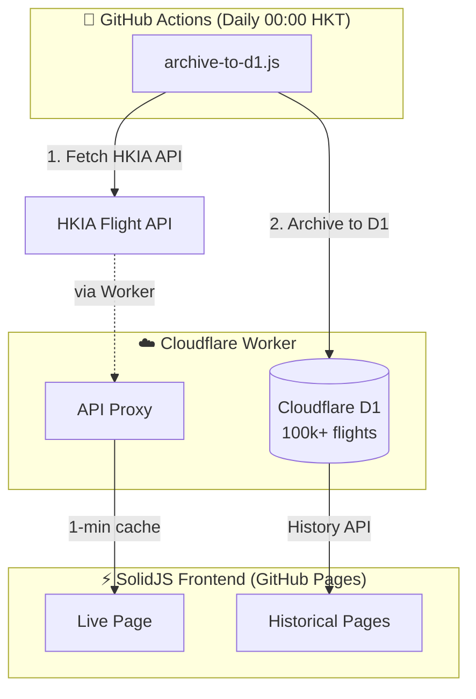

# HKG Flight Viewer

> 🛫 A high-performance, mobile-optimized flight information viewer for Hong Kong International Airport (HKIA)

[](https://a06073123.github.io/hkg-flight-viewer)
[](https://opensource.org/licenses/MIT)
[](https://solidjs.com)
[](https://typescriptlang.org)
[](https://tailwindcss.com)

---

## ✨ Features

- **📱 Mobile-First Design** - Optimized for travelers at the airport
- **⚡ Real-time Updates** - Live flight data with 1-minute edge caching
- **📊 Historical Data** - 100k+ flights stored in Cloudflare D1 database
- **🔍 Smart Search** - Search by flight number, airline, or destination
- **🚪 Gate Analytics** - View flight history for any gate
- **📦 Cargo Flights** - Integrated cargo view with alphanumeric IATA codes
- **🚀 Virtual Scrolling** - Smooth performance with 1000+ flight lists
- **☁️ Edge Computing** - Cloudflare Worker + D1 for sub-millisecond queries

---

## 🏗️ Architecture



---

## 🚀 Quick Start

### Prerequisites

- Node.js 20+
- npm or pnpm

### Installation

```bash
# Clone the repository
git clone https://github.com/a06073123/hkg-flight-viewer.git
cd hkg-flight-viewer

# Install dependencies
npm install

# Start development server
npm run dev
```

### Data Archiving (to D1 Database)

```bash
# Set environment variables
export CLOUDFLARE_ACCOUNT_ID="your-account-id"
export CLOUDFLARE_API_TOKEN="your-api-token"

# Archive today's flight data to D1
npm run archive

# Archive a specific date
npm run archive -- 2026-01-15

# Rolling archive past 6 days (for delayed flights)
npm run archive:rolling
```

---

## 📁 Project Structure

```
hkg-flight-viewer/
├── .github/
│   ├── copilot-instructions.md  # AI assistant context
│   └── workflows/
│       ├── ci.yml               # CI (PR only)
│       ├── deploy.yml           # Deploy to GitHub Pages
│       └── archive.yml          # Daily archive → D1 (scheduled)
│
├── worker/                      # Cloudflare Worker + D1 (Monorepo)
│   ├── src/index.ts             # Worker entry (API + D1 queries)
│   ├── schema.sql               # D1 database schema
│   ├── api.http                 # REST Client test file
│   ├── wrangler.toml            # Cloudflare config
│   └── package.json             # Worker dependencies
│
├── scripts/
│   ├── archive-to-d1.js         # Daily archiver → D1 database
│   └── fetch-airport-data.js    # Airport codes updater
│
├── public/data/
│   └── airports/                # Static airport code data
│       └── airports.json
│
├── src/
│   ├── types/
│   │   ├── flight.ts            # Flight interfaces (no enums)
│   │   └── map.ts               # Map marker types
│   ├── lib/
│   │   ├── api.ts               # API service layer
│   │   ├── parser.ts            # Data parsing utilities
│   │   ├── resources.ts         # SolidJS createResource hooks
│   │   ├── date-utils.ts        # HKT timezone utilities
│   │   ├── status-config.ts     # Flight status styling
│   │   ├── airline-data.ts      # Airline info loader
│   │   └── airport-data.ts      # Airport code lookups
│   ├── components/
│   │   ├── common/              # Shared UI (Tooltip, DatePicker, etc.)
│   │   ├── flights/             # FlightCard variants, FlightCardList
│   │   ├── history/             # FlightHistoryTable, CompactTimeStatus
│   │   ├── search/              # FlightSearch with autocomplete
│   │   └── layout/              # Layout wrapper
│   ├── pages/
│   │   ├── landing/             # Home page
│   │   ├── live/                # Real-time flights
│   │   ├── past/                # Historical browser
│   │   ├── flight/              # Per-flight history
│   │   ├── gate/                # Gate analytics
│   │   └── map/                 # HKIA virtual map (M5)
│   ├── App.tsx                  # Router setup
│   └── index.tsx                # Entry point
│
├── docs/
│   ├── API.md                   # HKIA API documentation
│   ├── AIRPORT-LAYOUT.md        # HKIA terminal & gate reference
│   └── MIGRATION-D1.md          # D1 migration guide
│
└── package.json                 # Root dependencies & scripts
```

---

## 🛠️ Tech Stack

| Category          | Technology                                               |
| ----------------- | -------------------------------------------------------- |
| **Framework**     | [SolidJS](https://solidjs.com) - Fine-grained reactivity |
| **Build Tool**    | [Vite](https://vite.dev) - Fast HMR & builds             |
| **UI Components** | [Ark UI](https://ark-ui.com) - Headless, accessible      |
| **Styling**       | [Tailwind CSS](https://tailwindcss.com) - Utility-first  |
| **Data Fetching** | SolidJS `createResource` - Native async data handling    |
| **Icons**         | [Lucide](https://lucide.dev) - Beautiful icons           |
| **Language**      | [TypeScript](https://typescriptlang.org) - Type safety   |

---

## 📊 Data Statistics

Stored in Cloudflare D1 database:

| Metric            | Value          |
| ----------------- | -------------- |
| **Total Flights** | 100,000+       |
| **Daily Average** | ~1,100 flights |
| **Airlines**      | 97+ mapped     |
| **Date Range**    | 2025-10-16 ~   |

### D1 Database

- **Name:** `hkg-flights`
- **Size:** ~52 MB
- **Location:** Cloudflare Edge (global)

---

## 📖 API Documentation

See [docs/API.md](docs/API.md) for comprehensive HKIA API documentation including:

- API endpoints and parameters
- Response structure
- Field specifications (codeshare, via routing, status codes)
- Data patterns analysis
- Error handling

### Key API Constraints

| Constraint     | Value                                   |
| -------------- | --------------------------------------- |
| **Date Range** | D-91 to D+14 from current date          |
| **Categories** | 4 (Arrival/Departure × Passenger/Cargo) |
| **Rate Limit** | Recommended 1 req/sec                   |

### Cloudflare Worker + D1 Database

The project uses a Cloudflare Worker with D1 database for:

- **CORS Proxy** - Bypass HKIA API restrictions
- **Edge Caching** - 1 min for flights, 12h for airlines
- **D1 Database** - Store 100k+ historical flight records
- **History API** - Query flight/gate history with sub-ms latency

**Endpoints:**

| Endpoint | Cache | Description |
| -------- | ----- | ----------- |
| `/api/flights` | 1 min | Today's flights (all categories) |
| `/api/airlines` | 12 hr | Airline info |
| `/api/history/flight/:no` | - | Flight history (fuzzy match) |
| `/api/history/gate/:id` | - | Gate departure history |
| `/api/history/date/:date` | - | All flights for a date |
| `/api/flight-list` | 1 hr | Unique flight numbers |
| `/api/stats` | - | Database statistics |

**Default Worker (Ready to Use):**

```
https://hkg-flight-proxy.lincoln995623.workers.dev
```

> 💡 Use [`worker/api.http`](worker/api.http) with [REST Client](https://marketplace.visualstudio.com/items?itemName=humao.rest-client) to test APIs in VS Code.

See [worker/README.md](worker/README.md) for deployment instructions.

---

## 🔄 GitHub Actions Workflow

The project includes automated daily data archiving:

```yaml
# .github/workflows/archive.yml
name: Daily Flight Archive
on:
    schedule:
        - cron: "30 16 * * *" # 00:00 HKT (16:00 UTC)
    workflow_dispatch:

jobs:
    archive:
        runs-on: ubuntu-latest
        steps:
            - uses: actions/checkout@v4
            - uses: actions/setup-node@v4
            - run: npm ci
            - run: npm run archive
            - uses: stefanzweifel/git-auto-commit-action@v5
              with:
                  commit_message: "chore: archive flight data for $(date -u +%Y-%m-%d)"
```

---

## 📜 Available Scripts

### Frontend

| Command                         | Description                           |
| ------------------------------- | ------------------------------------- |
| `npm run dev`                   | Start development server              |
| `npm run build`                 | Build for production                  |
| `npm run preview`               | Preview production build              |
| `npm run test`                  | Run tests in watch mode               |
| `npm run test:run`              | Run tests once                        |

### Data Archiving (D1 Database)

| Command                         | Description                           |
| ------------------------------- | ------------------------------------- |
| `npm run archive`               | Archive today's data to D1            |
| `npm run archive -- YYYY-MM-DD` | Archive specific date to D1           |
| `npm run archive:rolling`       | Rolling archive past 6 days           |
| `npm run archive:rolling 7`     | Rolling archive past 7 days           |

> **Note:** Requires `CLOUDFLARE_ACCOUNT_ID` and `CLOUDFLARE_API_TOKEN` environment variables.

### Cloudflare Worker

| Command                         | Description                           |
| ------------------------------- | ------------------------------------- |
| `npm run worker:dev`            | Start Worker dev server (port 8787)   |
| `npm run worker:deploy`         | Deploy Worker to Cloudflare           |
| `npm run worker:tail`           | View live Worker logs                 |

> **Tip:** Use `USE_PROXY=true npm run archive` to archive via Worker proxy.

---

## 🎯 Milestones

See [MILESTONE.md](MILESTONE.md) for detailed project roadmap.

| Milestone | Status         | Description                          |
| --------- | -------------- | ------------------------------------ |
| M1        | ✅ Complete    | Data Ingestion & D1 Archiving        |
| M2        | ✅ Complete    | Domain Logic & Data Parsing          |
| M3        | ✅ Complete    | Page Structure & Data Fetching       |
| M4        | 🚧 In Progress | Virtual List & Mobile Optimization   |
| M5        | ⏳ Planned     | HKIA Virtual Map & Visualization     |

---

## 📄 License

MIT License - see [LICENSE](LICENSE) for details.

---

## 📦 Data Sources & Credits

This project uses external data from the following sources. See [DATA-SOURCES.md](DATA-SOURCES.md) for complete licensing details.

| Data Type               | Source                                                                                                         | License                                                                |
| ----------------------- | -------------------------------------------------------------------------------------------------------------- | ---------------------------------------------------------------------- |
| **Flight Information**  | [HKIA Official API](https://www.hongkongairport.com)                                                           | [DATA.GOV.HK Terms](https://data.gov.hk/en/terms-and-conditions)       |
| **Airline Information** | [HKIA Airline JSON](https://www.hongkongairport.com/iwov-resources/custom/json/airline_en.json)                | [DATA.GOV.HK Terms](https://data.gov.hk/en/terms-and-conditions)       |
| **Airport Codes**       | [OurAirports](https://ourairports.com) via [datasets/airport-codes](https://github.com/datasets/airport-codes) | [PDDL (Public Domain)](https://opendatacommons.org/licenses/pddl/1-0/) |

### Attribution

> Flight and airline data © Hong Kong International Airport Authority, provided via DATA.GOV.HK Open Data platform.
>
> Airport data from OurAirports (https://ourairports.com), distributed under PDDL.

---

## 🙏 Acknowledgments

- [Hong Kong International Airport](https://www.hongkongairport.com) for the public flight data API
- [SolidJS](https://solidjs.com) community for the excellent framework
- [Ark UI](https://ark-ui.com) for accessible headless components

---

<p align="center">
  Made with ❤️ for travelers at HKG
</p>
