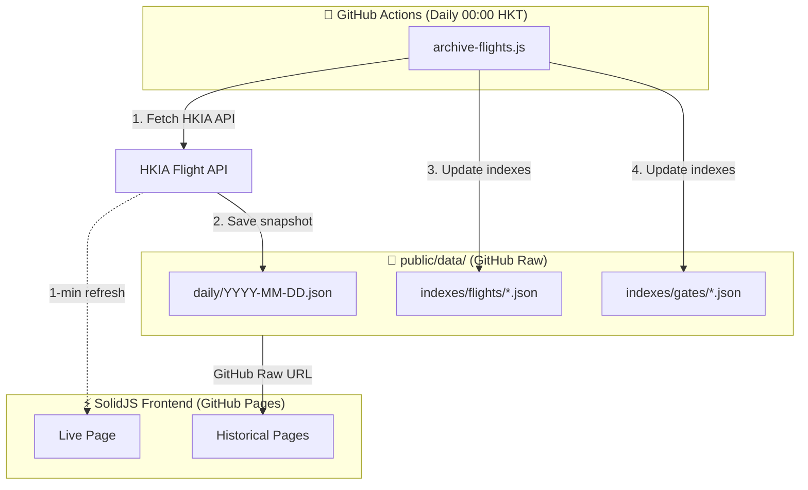

# HKG Flight Viewer

> 🛫 A high-performance, mobile-optimized flight information viewer for Hong Kong International Airport (HKIA)

[](https://a06073123.github.io/hkg-flight-viewer)
[](https://opensource.org/licenses/MIT)
[](https://solidjs.com)
[](https://typescriptlang.org)
[](https://tailwindcss.com)

---

## ✨ Features

- **📱 Mobile-First Design** - Optimized for travelers at the airport
- **⚡ Real-time Updates** - Live flight data with auto-refresh every 5 minutes
- **📊 Historical Data** - Access 93+ days of archived flight data
- **🔍 Smart Search** - Search by flight number, airline, or destination
- **🚪 Gate Analytics** - View flight history for any gate
- **📦 Cargo Flights** - Integrated cargo view in both Live and Historical modes
- **📦 Serverless Architecture** - Deployed on GitHub Pages, no backend required

---

## 🏗️ Architecture



---

## 🚀 Quick Start

### Prerequisites

- Node.js 20+
- npm or pnpm

### Installation

```bash
# Clone the repository
git clone https://github.com/a06073123/hkg-flight-viewer.git
cd hkg-flight-viewer

# Install dependencies
npm install

# Start development server
npm run dev
```

### Data Archiving

```bash
# Archive today's flight data
npm run archive

# Archive a specific date
npm run archive -- 2026-01-15

# Rebuild all indexes from daily snapshots
npm run reindex

# Clean rebuild (removes existing indexes first)
npm run reindex:clean

# Analyze all collected data
npm run analyze
```

---

## 📁 Project Structure

```
hkg-flight-viewer/
├── .github/
│   ├── copilot-instructions.md  # AI assistant context
│   └── workflows/
│       ├── ci.yml               # CI (PR only)
│       ├── deploy.yml           # Deploy to GitHub Pages
│       └── archive.yml          # Daily archive (scheduled)
│
├── worker/                      # Cloudflare Worker Proxy (Monorepo)
│   ├── src/index.ts             # Worker entry point
│   ├── wrangler.toml            # Cloudflare config
│   └── package.json             # Worker dependencies
│
├── scripts/
│   ├── archive-flights.js       # Daily data archiver
│   ├── archive-rolling.js       # Rolling archive for delayed flights
│   ├── reindex-flights.js       # Rebuild indexes from snapshots
│   └── analyze-data.js          # Data analysis tool
│
├── public/data/                 # NOT included in build (fetched via GitHub Raw)
│   ├── daily/                   # Full daily snapshots
│   │   └── YYYY-MM-DD.json
│   └── indexes/
│       ├── flights/             # Per-flight history (max 50 entries)
│       └── gates/               # Per-gate history (max 50 entries)
│
├── src/
│   ├── types/flight.ts          # TypeScript interfaces (no enums)
│   ├── lib/
│   │   ├── api.ts               # API service layer
│   │   ├── parser.ts            # Data parsing utilities
│   │   └── resources.ts         # SolidJS createResource hooks
│   ├── components/              # UI components (feature-based)
│   ├── pages/                   # Route pages
│   ├── App.tsx                  # Router setup
│   └── index.tsx                # Entry point
│
├── docs/
│   └── API.md                   # HKIA API documentation
│
└── package.json                 # Root dependencies & scripts
```

---

## 🛠️ Tech Stack

| Category          | Technology                                               |
| ----------------- | -------------------------------------------------------- |
| **Framework**     | [SolidJS](https://solidjs.com) - Fine-grained reactivity |
| **Build Tool**    | [Vite](https://vite.dev) - Fast HMR & builds             |
| **UI Components** | [Ark UI](https://ark-ui.com) - Headless, accessible      |
| **Styling**       | [Tailwind CSS](https://tailwindcss.com) - Utility-first  |
| **Data Fetching** | SolidJS `createResource` - Native async data handling    |
| **Icons**         | [Lucide](https://lucide.dev) - Beautiful icons           |
| **Language**      | [TypeScript](https://typescriptlang.org) - Type safety   |

---

## 📊 Data Statistics

Based on analysis of 93 days (2025-10-16 to 2026-01-16):

| Metric            | Value          |
| ----------------- | -------------- |
| **Total Flights** | 104,732        |
| **Daily Average** | ~1,126 flights |
| **Arrivals**      | 52,107 (49.8%) |
| **Departures**    | 52,625 (50.2%) |
| **Passenger**     | 80,264 (76.6%) |
| **Cargo**         | 24,468 (23.4%) |
| **Airlines**      | 144 unique     |

### Top Airlines

| Rank | Airline                 | Flights |
| ---- | ----------------------- | ------- |
| 1    | Cathay Pacific (CX)     | 49,895  |
| 2    | HK Express (UO)         | 11,904  |
| 3    | Hong Kong Airlines (HX) | 10,806  |
| 4    | Qatar Airways (QR)      | 9,955   |
| 5    | Finnair (AY)            | 7,181   |

---

## 📖 API Documentation

See [docs/API.md](docs/API.md) for comprehensive HKIA API documentation including:

- API endpoints and parameters
- Response structure
- Field specifications (codeshare, via routing, status codes)
- Data patterns analysis
- Error handling

### Key API Constraints

| Constraint     | Value                                   |
| -------------- | --------------------------------------- |
| **Date Range** | D-91 to D+14 from current date          |
| **Categories** | 4 (Arrival/Departure × Passenger/Cargo) |
| **Rate Limit** | Recommended 1 req/sec                   |

### Cloudflare Worker Proxy

For production deployment on GitHub Pages, a Cloudflare Worker proxy is required to:

- Bypass CORS restrictions (HKIA API lacks `Access-Control-Allow-Origin`)
- Prevent 403 errors from direct browser requests
- Combine 4 API calls into 1 for better performance
- Add edge caching (1 min for flights, 12h for airlines)

**Endpoints:**

| Endpoint        | Cache | Description                                   |
| --------------- | ----- | --------------------------------------------- |
| `/api/flights`  | 1 min | Today's flights (all categories combined)     |
| `/api/airlines` | 12 hr | Airline info (check-in counters, names, etc.) |
| `/api/health`   | -     | Health check                                  |

**Default Worker (Ready to Use):**

The project includes a pre-configured Cloudflare Worker proxy at:
```
https://hkg-flight-proxy.lincoln995623.workers.dev
```

**For Fork Users (Optional):**

If you want to deploy your own Worker:

```bash
# 1. Deploy your own Worker
cd worker
npm install
wrangler login
npm run deploy

# 2. Update the API URL in src/lib/api.ts and src/lib/airline-data.ts:
# const API_BASE_URL = "https://your-worker.your-subdomain.workers.dev/api"

# 3. Update scripts/archive-flights.js PROXY_URL if using proxy for archiving
```

See [worker/README.md](worker/README.md) for detailed Worker documentation.

---

## 🔄 GitHub Actions Workflow

The project includes automated daily data archiving:

```yaml
# .github/workflows/archive.yml
name: Daily Flight Archive
on:
    schedule:
        - cron: "30 16 * * *" # 00:00 HKT (16:00 UTC)
    workflow_dispatch:

jobs:
    archive:
        runs-on: ubuntu-latest
        steps:
            - uses: actions/checkout@v4
            - uses: actions/setup-node@v4
            - run: npm ci
            - run: npm run archive
            - uses: stefanzweifel/git-auto-commit-action@v5
              with:
                  commit_message: "chore: archive flight data for $(date -u +%Y-%m-%d)"
```

---

## 📜 Available Scripts

### Frontend

| Command                         | Description                           |
| ------------------------------- | ------------------------------------- |
| `npm run dev`                   | Start development server              |
| `npm run build`                 | Build for production                  |
| `npm run preview`               | Preview production build              |
| `npm run test`                  | Run tests in watch mode               |
| `npm run test:run`              | Run tests once                        |

### Data Archiving

| Command                         | Description                           |
| ------------------------------- | ------------------------------------- |
| `npm run archive`               | Archive today's flight data           |
| `npm run archive -- YYYY-MM-DD` | Archive specific date                 |
| `npm run archive:rolling`       | Rolling archive past 6 days           |
| `npm run reindex:clean`         | Clean and rebuild all indexes         |
| `npm run analyze`               | Run comprehensive data analysis       |

### Cloudflare Worker

| Command                         | Description                           |
| ------------------------------- | ------------------------------------- |
| `npm run worker:dev`            | Start Worker dev server (port 8787)   |
| `npm run worker:deploy`         | Deploy Worker to Cloudflare           |
| `npm run worker:tail`           | View live Worker logs                 |

> **Tip:** Use `USE_PROXY=true npm run archive` to archive via Worker proxy.

---

## 🎯 Milestones

See [MILESTONE.md](MILESTONE.md) for detailed project roadmap.

| Milestone | Status         | Description                    |
| --------- | -------------- | ------------------------------ |
| M1        | ✅ Complete    | Data Ingestion & Archiving     |
| M2        | ✅ Complete    | Domain Logic & Data Parsing    |
| M3        | ✅ Complete    | Page Structure & Data Fetching |
| M4        | 🚧 In Progress | UX Polish & Charts             |
| M5        | ⏳ Planned     | Deployment & Production        |

---

## 📄 License

MIT License - see [LICENSE](LICENSE) for details.

---

## 📦 Data Sources & Credits

This project uses external data from the following sources. See [DATA-SOURCES.md](DATA-SOURCES.md) for complete licensing details.

| Data Type               | Source                                                                                                         | License                                                                |
| ----------------------- | -------------------------------------------------------------------------------------------------------------- | ---------------------------------------------------------------------- |
| **Flight Information**  | [HKIA Official API](https://www.hongkongairport.com)                                                           | [DATA.GOV.HK Terms](https://data.gov.hk/en/terms-and-conditions)       |
| **Airline Information** | [HKIA Airline JSON](https://www.hongkongairport.com/iwov-resources/custom/json/airline_en.json)                | [DATA.GOV.HK Terms](https://data.gov.hk/en/terms-and-conditions)       |
| **Airport Codes**       | [OurAirports](https://ourairports.com) via [datasets/airport-codes](https://github.com/datasets/airport-codes) | [PDDL (Public Domain)](https://opendatacommons.org/licenses/pddl/1-0/) |

### Attribution

> Flight and airline data © Hong Kong International Airport Authority, provided via DATA.GOV.HK Open Data platform.
>
> Airport data from OurAirports (https://ourairports.com), distributed under PDDL.

---

## 🙏 Acknowledgments

- [Hong Kong International Airport](https://www.hongkongairport.com) for the public flight data API
- [SolidJS](https://solidjs.com) community for the excellent framework
- [Ark UI](https://ark-ui.com) for accessible headless components

---

<p align="center">
  Made with ❤️ for travelers at HKG
</p>
