# HKG Flight Viewer

> 🛫 A high-performance, mobile-optimized flight information viewer for Hong Kong International Airport (HKIA)

[](https://github.com)
[](https://solidjs.com)
[](https://typescriptlang.org)
[](https://tailwindcss.com)

---

## ✨ Features

- **📱 Mobile-First Design** - Optimized for travelers at the airport
- **⚡ Real-time Updates** - Live flight data with auto-refresh every 5 minutes
- **📊 Historical Data** - Access 93+ days of archived flight data
- **🔍 Smart Search** - Search by flight number, airline, or destination
- **🚪 Gate Analytics** - View flight history for any gate
- **📦 Cargo Flights** - Integrated cargo view in both Live and Historical modes
- **📦 Serverless Architecture** - Deployed on GitHub Pages, no backend required

---

## 🏗️ Architecture

```mermaid
flowchart TB
    subgraph Actions["🔄 GitHub Actions (Daily 00:00 HKT)"]
        Cron["archive-flights.js"]
    end

    Cron --> |"1. Fetch HKIA API"| API["HKIA Flight API"]
    API --> |"2. Save snapshot"| Daily["daily/YYYY-MM-DD.json"]
    Cron --> |"3. Update indexes"| IndexF["indexes/flights/*.json"]
    Cron --> |"4. Update indexes"| IndexG["indexes/gates/*.json"]

    subgraph Data["📁 public/data/"]
        Daily
        IndexF
        IndexG
    end

    subgraph Frontend["⚡ SolidJS Frontend"]
        Live["Live Page"]
        Historical["Historical Pages"]
    end

    API -.-> |"5-min refresh"| Live
    Data --> |"Static fetch"| Historical
```



---

## 🚀 Quick Start

### Prerequisites

- Node.js 20+
- npm or pnpm

### Installation

```bash
# Clone the repository
git clone https://github.com/yourusername/hkg-flight-viewer.git
cd hkg-flight-viewer

# Install dependencies
npm install

# Start development server
npm run dev
```

### Data Archiving

```bash
# Archive today's flight data
npm run archive

# Archive a specific date
npm run archive -- 2026-01-15

# Rebuild all indexes from daily snapshots
npm run reindex

# Clean rebuild (removes existing indexes first)
npm run reindex:clean

# Analyze all collected data
npm run analyze
```

---

## 📁 Project Structure

```
hkg-flight-viewer/
├── scripts/
│   ├── archive-flights.js    # Daily data archiver (GitHub Actions)
│   ├── reindex-flights.js    # Rebuild indexes from snapshots
│   └── analyze-data.js       # Data analysis tool
│
├── public/
│   └── data/
│       ├── daily/            # Full daily snapshots
│       │   └── YYYY-MM-DD.json
│       └── indexes/
│           ├── flights/      # Per-flight history (max 50 entries)
│           │   └── {flightNo}.json
│           └── gates/        # Per-gate history (max 50 entries)
│               └── {gateNo}.json
│
├── src/
│   ├── types/
│   │   └── flight.ts         # TypeScript interfaces (no enums)
│   ├── lib/
│   │   ├── api.ts            # API service layer
│   │   ├── parser.ts         # Data parsing utilities
│   │   ├── parser.test.ts    # Parser tests
│   │   └── resources.ts      # SolidJS createResource hooks
│   ├── components/
│   │   ├── dashboard/        # Dashboard components
│   │   ├── flights/          # Flight display components
│   │   ├── search/           # Search components
│   │   └── layout/           # Layout components
│   ├── pages/
│   │   ├── landing/          # Home page (/)
│   │   ├── live/             # Live flights (/live)
│   │   ├── past/             # Historical data (/past)
│   │   ├── flight/           # Flight history (/flight/:no)
│   │   └── gate/             # Gate analytics (/gate/:id)
│   ├── App.tsx               # Router setup
│   └── index.tsx             # Entry point
│
├── docs/
│   ├── API.md                # HKIA API documentation
│   └── data-analysis.json    # Analysis results
│
├── MILESTONE.md              # Project milestones
├── CONTRIBUTING.md           # Branching strategy & guidelines
└── .github/workflows/
    ├── ci.yml                # CI (PR only)
    ├── deploy.yml            # Deploy to GitHub Pages
    └── archive.yml           # Daily archive (scheduled)
```

---

## 🛠️ Tech Stack

| Category          | Technology                                               |
| ----------------- | -------------------------------------------------------- |
| **Framework**     | [SolidJS](https://solidjs.com) - Fine-grained reactivity |
| **Build Tool**    | [Vite](https://vite.dev) - Fast HMR & builds             |
| **UI Components** | [Ark UI](https://ark-ui.com) - Headless, accessible      |
| **Styling**       | [Tailwind CSS](https://tailwindcss.com) - Utility-first  |
| **Data Fetching** | SolidJS `createResource` - Native async data handling    |
| **Icons**         | [Lucide](https://lucide.dev) - Beautiful icons           |
| **Language**      | [TypeScript](https://typescriptlang.org) - Type safety   |

---

## 📊 Data Statistics

Based on analysis of 93 days (2025-10-16 to 2026-01-16):

| Metric            | Value          |
| ----------------- | -------------- |
| **Total Flights** | 104,732        |
| **Daily Average** | ~1,126 flights |
| **Arrivals**      | 52,107 (49.8%) |
| **Departures**    | 52,625 (50.2%) |
| **Passenger**     | 80,264 (76.6%) |
| **Cargo**         | 24,468 (23.4%) |
| **Airlines**      | 144 unique     |

### Top Airlines

| Rank | Airline                 | Flights |
| ---- | ----------------------- | ------- |
| 1    | Cathay Pacific (CX)     | 49,895  |
| 2    | HK Express (UO)         | 11,904  |
| 3    | Hong Kong Airlines (HX) | 10,806  |
| 4    | Qatar Airways (QR)      | 9,955   |
| 5    | Finnair (AY)            | 7,181   |

---

## 📖 API Documentation

See [docs/API.md](docs/API.md) for comprehensive HKIA API documentation including:

- API endpoints and parameters
- Response structure
- Field specifications (codeshare, via routing, status codes)
- Data patterns analysis
- Error handling

### Key API Constraints

| Constraint     | Value                                   |
| -------------- | --------------------------------------- |
| **Date Range** | D-91 to D+14 from current date          |
| **Categories** | 4 (Arrival/Departure × Passenger/Cargo) |
| **Rate Limit** | Recommended 1 req/sec                   |

---

## 🔄 GitHub Actions Workflow

The project includes automated daily data archiving:

```yaml
# .github/workflows/archive.yml
name: Daily Flight Archive
on:
    schedule:
        - cron: "30 16 * * *" # 00:00 HKT (16:00 UTC)
    workflow_dispatch:

jobs:
    archive:
        runs-on: ubuntu-latest
        steps:
            - uses: actions/checkout@v4
            - uses: actions/setup-node@v4
            - run: npm ci
            - run: npm run archive
            - uses: stefanzweifel/git-auto-commit-action@v5
              with:
                  commit_message: "chore: archive flight data for $(date -u +%Y-%m-%d)"
```

---

## 📜 Available Scripts

| Command                         | Description                           |
| ------------------------------- | ------------------------------------- |
| `npm run dev`                   | Start development server              |
| `npm run build`                 | Build for production                  |
| `npm run preview`               | Preview production build              |
| `npm run archive`               | Archive today's flight data           |
| `npm run archive -- YYYY-MM-DD` | Archive specific date                 |
| `npm run reindex`               | Rebuild indexes from daily snapshots  |
| `npm run reindex:clean`         | Clean and rebuild all indexes         |
| `npm run analyze`               | Run comprehensive data analysis       |
| `npm run fetch:airports`        | Update airport codes from OurAirports |
| `npm run minify:json`           | Minify all JSON files in public/data  |

---

## 🎯 Milestones

See [MILESTONE.md](MILESTONE.md) for detailed project roadmap.

| Milestone | Status         | Description                    |
| --------- | -------------- | ------------------------------ |
| M1        | ✅ Complete    | Data Ingestion & Archiving     |
| M2        | ✅ Complete    | Domain Logic & Data Parsing    |
| M3        | ✅ Complete    | Page Structure & Data Fetching |
| M4        | 🚧 In Progress | UX Polish & Charts             |
| M5        | ⏳ Planned     | Deployment & Production        |

---

## 📄 License

MIT License - see [LICENSE](LICENSE) for details.

---

## 📦 Data Sources & Credits

This project uses external data from the following sources. See [DATA-SOURCES.md](DATA-SOURCES.md) for complete licensing details.

| Data Type               | Source                                                                                                         | License                                                                |
| ----------------------- | -------------------------------------------------------------------------------------------------------------- | ---------------------------------------------------------------------- |
| **Flight Information**  | [HKIA Official API](https://www.hongkongairport.com)                                                           | [DATA.GOV.HK Terms](https://data.gov.hk/en/terms-and-conditions)       |
| **Airline Information** | [HKIA Airline JSON](https://www.hongkongairport.com/iwov-resources/custom/json/airline_en.json)                | [DATA.GOV.HK Terms](https://data.gov.hk/en/terms-and-conditions)       |
| **Airport Codes**       | [OurAirports](https://ourairports.com) via [datasets/airport-codes](https://github.com/datasets/airport-codes) | [PDDL (Public Domain)](https://opendatacommons.org/licenses/pddl/1-0/) |

### Attribution

> Flight and airline data © Hong Kong International Airport Authority, provided via DATA.GOV.HK Open Data platform.
>
> Airport data from OurAirports (https://ourairports.com), distributed under PDDL.

---

## 🙏 Acknowledgments

- [Hong Kong International Airport](https://www.hongkongairport.com) for the public flight data API
- [SolidJS](https://solidjs.com) community for the excellent framework
- [Ark UI](https://ark-ui.com) for accessible headless components

---

<p align="center">
  Made with ❤️ for travelers at HKG
</p>
