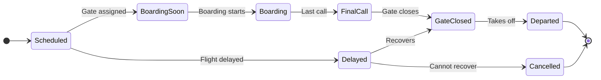
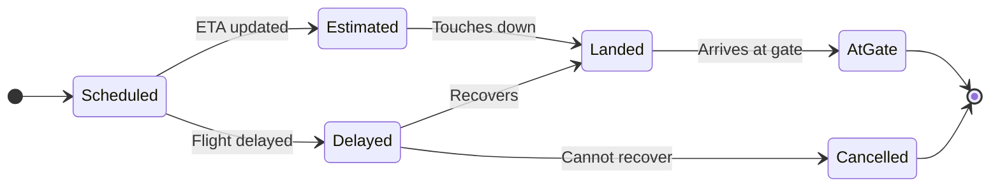

# HKG Airport Flight Information API Documentation

> **Data Source:** Hong Kong International Airport (HKIA) Flight Information REST API
>
> **Reference:** [HKIA Flight Information Data Specification](https://www.hongkongairport.com/iwov-resources/misc/opendata/Flight_Information_DataSpec_en.pdf)

---

## Table of Contents

1. [API Endpoints](#api-endpoints)
2. [Request Parameters](#request-parameters)
3. [Response Structure](#response-structure)
4. [Field Specifications](#field-specifications)
5. [Status Codes](#status-codes)
6. [Data Patterns Analysis](#data-patterns-analysis)
7. [Error Handling](#error-handling)

---

## API Endpoints

### Past Flights (Historical + Today)

```
GET https://www.hongkongairport.com/flightinfo-rest/rest/flights/past
```

Returns flight data for the specified date.

### Valid Date Range

> ⚠️ **Important:** The API only accepts dates within **D-91 to D+14** from the current date.

| Range    | Description           | Example (if today is 2026-01-15) |
| -------- | --------------------- | -------------------------------- |
| **D-91** | 91 days in the past   | 2025-10-16                       |
| **D+14** | 14 days in the future | 2026-01-29                       |

---

## Request Parameters

| Parameter | Type    | Required | Description                             |
| --------- | ------- | -------- | --------------------------------------- |
| `date`    | string  | Yes      | Date in `YYYY-MM-DD` format             |
| `lang`    | string  | Yes      | Language: `en`, `zh_HK`, `zh_CN`        |
| `arrival` | boolean | Yes      | `true` = Arrivals, `false` = Departures |
| `cargo`   | boolean | Yes      | `true` = Cargo, `false` = Passenger     |

### Example Request

```bash
# Passenger arrivals for 2026-01-15
curl "https://www.hongkongairport.com/flightinfo-rest/rest/flights/past?date=2026-01-15&lang=en&arrival=true&cargo=false"

# Cargo departures for 2026-01-15
curl "https://www.hongkongairport.com/flightinfo-rest/rest/flights/past?date=2026-01-15&lang=en&arrival=false&cargo=true"
```

### Four API Categories

To get complete flight data for a day, query all four combinations:

| Category             | `arrival` | `cargo` |
| -------------------- | --------- | ------- |
| Passenger Arrivals   | `true`    | `false` |
| Passenger Departures | `false`   | `false` |
| Cargo Arrivals       | `true`    | `true`  |
| Cargo Departures     | `false`   | `true`  |

---

## Response Structure

```json
[
	{
		"date": "2026-01-15",
		"list": [
			{
				"time": "08:30",
				"flight": [{ "no": "CX 888", "airline": "CPA" }],
				"origin": ["NRT"],
				"destination": ["NRT"],
				"status": "At gate 08:25",
				"gate": "23",
				"baggage": "12",
				"terminal": "T1",
				"aisle": "BC",
				"hall": "A",
				"stand": "511"
			}
		]
	}
]
```

---

## Field Specifications

### Flight Identification

| Field              | Type   | Description                                        |
| ------------------ | ------ | -------------------------------------------------- |
| `flight`           | Array  | Array of flight identifiers                        |
| `flight[].no`      | string | Flight number with airline code (e.g., `"CX 888"`) |
| `flight[].airline` | string | ICAO airline code (e.g., `"CPA"`)                  |

#### Codeshare Structure

The `flight` array follows this convention:

| Position               | Meaning                                                      |
| ---------------------- | ------------------------------------------------------------ |
| **First entry**        | Operating carrier (airline actually operating the aircraft)  |
| **Subsequent entries** | Codeshare partners (airlines selling tickets on this flight) |

**Example: 5-way codeshare**

```json
{
	"flight": [
		{ "no": "CX 636", "airline": "CPA" },
		{ "no": "GF 4062", "airline": "GFA" },
		{ "no": "AY 5852", "airline": "FIN" },
		{ "no": "OM 5614", "airline": "MGL" },
		{ "no": "FJ 5463", "airline": "FJI" }
	]
}
```

### Route Information

| Field         | Type  | Appears In | Description                       |
| ------------- | ----- | ---------- | --------------------------------- |
| `origin`      | Array | Arrivals   | Origin airport(s) IATA codes      |
| `destination` | Array | Departures | Destination airport(s) IATA codes |

#### Via/Transit Routing

When the array contains multiple airports, it indicates a flight with intermediate stops:

| Array Length | Meaning            |
| ------------ | ------------------ |
| 1            | Direct flight      |
| 2+           | Via/transit flight |

**For Arrivals:**

- First airport = Original departure point
- Subsequent airports = Via stops before HKG

**For Departures:**

- First airports = Via stops after HKG
- Last airport = Final destination

**Example: Arrival via Bangkok**

```json
{
	"flight": [{ "no": "EK 384", "airline": "UAE" }],
	"origin": ["DXB", "BKK"]
}
```

Route: Dubai → Bangkok → Hong Kong

**Example: Multi-stop cargo**

```json
{
	"flight": [{ "no": "5X 168", "airline": "UPS" }],
	"origin": ["SDF", "SIN", "PEN", "SGN"]
}
```

Route: Louisville → Singapore → Penang → Ho Chi Minh → Hong Kong

### Time and Schedule

| Field  | Type   | Format  | Description              |
| ------ | ------ | ------- | ------------------------ |
| `time` | string | `HH:MM` | Scheduled time (24-hour) |

### Location Information

| Field      | Type   | Appears In | Description                 |
| ---------- | ------ | ---------- | --------------------------- |
| `terminal` | string | Both       | Terminal designation (`T1`) |
| `gate`     | string | Departures | Departure gate number       |
| `baggage`  | string | Arrivals   | Baggage claim belt number   |
| `hall`     | string | Arrivals   | Arrival hall (`A` or `B`)   |
| `aisle`    | string | Departures | Gate aisle designation      |
| `stand`    | string | Both       | Aircraft parking stand      |

#### Terminal Map

Currently, only Terminal 1 (`T1`) is in use for passenger operations.

#### Hall Distribution

| Hall | Location | Typical Usage           |
| ---- | -------- | ----------------------- |
| A    | South    | Gates 1-40, Midfield    |
| B    | North    | Gates 201-230, Midfield |

#### Aisle Codes

| Aisle      | Location Description |
| ---------- | -------------------- |
| A          | Near gates 1-9       |
| B, BC, C   | Central gates        |
| D, E, F, G | Midfield area        |
| H, J, K, L | North satellite      |

---

## Status Codes

### Status Patterns

Based on analysis of 104,732 flight records:

| Pattern                      | Count  | Percentage | Description                  |
| ---------------------------- | ------ | ---------- | ---------------------------- |
| `Dep HH:MM`                  | 49,153 | 46.9%      | Departed at specified time   |
| `At gate HH:MM`              | 48,564 | 46.4%      | Arrived at gate              |
| `Cancelled`                  | 2,734  | 2.6%       | Flight cancelled             |
| `At gate HH:MM (DD/MM/YYYY)` | 1,474  | 1.4%       | Arrived on different date    |
| `Dep HH:MM (DD/MM/YYYY)`     | 1,468  | 1.4%       | Departed on different date   |
| _(empty)_                    | 1,071  | 1.0%       | Status not yet available     |
| `Est at HH:MM`               | 183    | 0.2%       | Estimated arrival time       |
| `Est at HH:MM (DD/MM/YYYY)`  | 41     | 0.04%      | Estimated for different date |
| `Gate Closed`                | 13     | 0.01%      | Gate has closed              |
| `Boarding Soon`              | 9      | 0.01%      | Boarding imminent            |
| `Landed HH:MM`               | 8      | 0.01%      | Aircraft landed              |
| `Final Call`                 | 7      | 0.01%      | Last boarding call           |
| `Delayed`                    | 4      | 0.004%     | Flight delayed               |
| `Boarding`                   | 3      | 0.003%     | Currently boarding           |

### Status State Machine

#### Departures



> **Status Format:** `Dep HH:MM` or `Dep HH:MM (DD/MM/YYYY)`

#### Arrivals



> **Status Formats:**
>
> - Estimated: `Est at HH:MM`
> - Landed: `Landed HH:MM`
> - At Gate: `At gate HH:MM`

---

## Data Patterns Analysis

Based on comprehensive analysis of 93 days of data (2025-10-16 to 2026-01-16).

### Overall Statistics

| Metric        | Value          |
| ------------- | -------------- |
| Total Flights | 104,732        |
| Arrivals      | 52,107 (49.8%) |
| Departures    | 52,625 (50.2%) |
| Passenger     | 80,264 (76.6%) |
| Cargo         | 24,468 (23.4%) |

### Codeshare Distribution

| Flights in Codeshare | Count  | Percentage |
| -------------------- | ------ | ---------- |
| 1 (no codeshare)     | 51,984 | 49.6%      |
| 2                    | 33,364 | 31.9%      |
| 3                    | 6,330  | 6.0%       |
| 4                    | 5,890  | 5.6%       |
| 5                    | 3,227  | 3.1%       |
| 6                    | 2,011  | 1.9%       |
| 7                    | 1,284  | 1.2%       |
| 8                    | 375    | 0.4%       |
| 9                    | 176    | 0.2%       |
| 10                   | 91     | 0.1%       |

**Maximum codeshare observed:** 10 flights on a single aircraft

### Via/Transit Distribution

| Routing     | Count  | Percentage |
| ----------- | ------ | ---------- |
| Direct      | 94,533 | 90.3%      |
| Via 1 stop  | 8,954  | 8.5%       |
| Via 2 stops | 1,085  | 1.0%       |
| Via 3 stops | 160    | 0.2%       |

### Top Airlines (by flight count)

| ICAO | IATA | Airline            | Flights |
| ---- | ---- | ------------------ | ------- |
| CPA  | CX   | Cathay Pacific     | 49,895  |
| HKE  | UO   | HK Express         | 11,904  |
| CRK  | HX   | Hong Kong Airlines | 10,806  |
| QTR  | QR   | Qatar Airways      | 9,955   |
| MGL  | OM   | MIAT Mongolian     | 7,497   |
| FIN  | AY   | Finnair            | 7,181   |
| JAL  | JL   | Japan Airlines     | 6,540   |
| CCA  | CA   | Air China          | 6,064   |
| AAL  | AA   | American Airlines  | 5,907   |
| BAW  | BA   | British Airways    | 5,297   |

### Time Distribution

Peak hours (flights per hour):

| Hour  | Flights | Activity Level    |
| ----- | ------- | ----------------- |
| 19:00 | 6,010   | ████████████ Peak |
| 17:00 | 5,891   | ███████████ High  |
| 16:00 | 5,647   | ███████████ High  |
| 14:00 | 5,615   | ███████████ High  |
| 13:00 | 5,568   | ███████████ High  |
| 02:00 | 1,743   | ███ Low           |
| 03:00 | 1,869   | ████ Low          |

---

## Error Handling

### Error Response Structure

```json
{
	"problemNo": "c177288b6cfebb200a8302cf4b1824b8",
	"message": "The combination of parameter date [2025-10-01] and span [1] is out of valid range (D-91 to D+14)."
}
```

### Common Errors

| Error              | Cause                               | Solution                      |
| ------------------ | ----------------------------------- | ----------------------------- |
| Date out of range  | Requested date outside D-91 to D+14 | Use date within valid range   |
| Invalid parameters | Missing or malformed parameters     | Check all required parameters |
| Rate limiting      | Too many requests                   | Add delays between requests   |

---

## Appendix

### ICAO to IATA Airline Code Mapping

```javascript
{
  "CPA": "CX",  // Cathay Pacific
  "HKE": "UO",  // HK Express
  "CRK": "HX",  // Hong Kong Airlines
  "QTR": "QR",  // Qatar Airways
  "MGL": "OM",  // MIAT Mongolian Airlines
  "FIN": "AY",  // Finnair
  "JAL": "JL",  // Japan Airlines
  "CCA": "CA",  // Air China
  "AAL": "AA",  // American Airlines
  "BAW": "BA",  // British Airways
  "CES": "MU",  // China Eastern
  "THY": "TK",  // Turkish Airlines
  "CHH": "HU",  // Hainan Airlines
  "QFA": "QF",  // Qantas
  "EVA": "BR",  // EVA Air
  "MAS": "MH",  // Malaysia Airlines
  "LAN": "LA",  // LATAM
  "HGB": "HB",  // Greater Bay Airlines
  "CAL": "CI",  // China Airlines
  "FJI": "FJ",  // Fiji Airways
  "ACA": "AC",  // Air Canada
  "ETD": "EY",  // Etihad Airways
  "DLH": "LH",  // Lufthansa
  "UAE": "EK",  // Emirates
  "UAL": "UA",  // United Airlines
  "GFA": "GF"   // Gulf Air
}
```

### Baggage Claim Belts

| Belt      | Typical Usage      |
| --------- | ------------------ |
| 2-17      | All active belts   |
| Most used | 16, 12, 13, 17, 10 |

### Gate Ranges

| Range   | Location           |
| ------- | ------------------ |
| 1-40    | Terminal 1 Main    |
| 201-230 | North Satellite    |
| 501-510 | Midfield Concourse |
